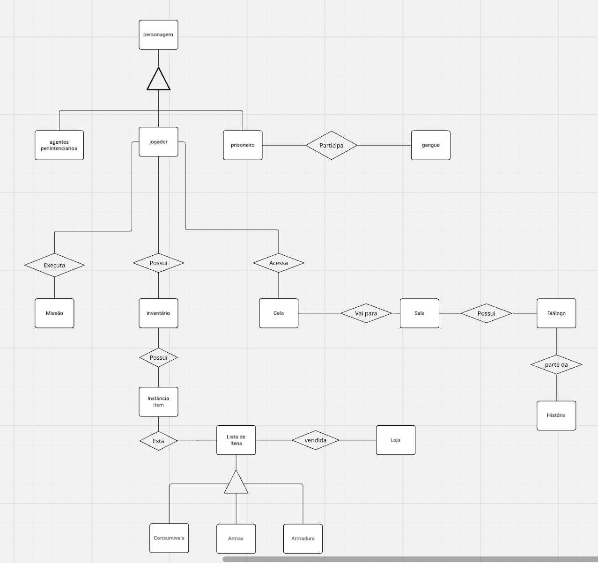

<<<<<<< HEAD
# Reunião 03 - 12.04.2025

## Local
Reunião realizada via Discord.

## Participantes

<strong> Tabela 1:  </strong>Participantes da reunião

| Matrícula | Aluno                               | Presente |
| --------- | ----------------------------------- | -------- |
| 221021102 | Ana Carolina Madeira Fialho         | ✓       |
| 211063210 | Maria Alice Bernardo da Costa Silva | ✓        |
| 222025914 | Marllon Fausto Cardoso              | ✓        |
| 200025058 | Mayara Alves de Oliveira            | ✓        |
| 200043030 | Renann de Oliveira Gomes            | x        |

<strong> Fonte: </strong> xxx, 2025

<!-- 

    Se o membro estiver presente: ✓
    Se o membro faltar: x

 -->

<!-- 
    Matrículas e github pra facilitar:

    222025914  [Marllon Cardoso](https://github.com/m4rllon)
    200025058  [Mayara Oliveira](https://github.com/mayara-tech)
    200043030  [Renann Gomes](https://github.com/renannOgomes)
    211063210  [Maria Alice](https://github.com/maliz30)
    221021102  [Ana Carolina Fialho](https://github.com/anawcarol)
 -->

## Início e término
Na tabela 2 consta o horário de início e o horário de término da reunião.

<strong>Tabela 2: </strong>Horários

| Hora de Início | Hora de Término |
| -------------- | --------------- |
| 10:00          | 11:20           |

<strong>Fonte: </strong> xxx, 2025

## Pautas

- Detalhar os relacionamentos entre as entidades do projeto.

- Revisar os atributos existentes e adicionar novos, se necessário.

- Distribuir as responsabilidades entre os membros da equipe.

- Configurar o repositório para o desenvolvimento do projeto.

## O que foi feito durante a reunião
### 1. Segunda idealização do DER

{: style="width: 50%; display: block; margin: 0 auto;" }

| Atividade                                     | Responsável                                                                               |
| --------------------------------------------- | ----------------------------------------------------------------------------------------- |
| Escrever primeiras atas         | [Ana Carolina](https://github.com/anawcarol)                                         |
| Revisar relacionamentos e adicionar atributos | Todos |
| Ambientalização do repositório       | [Mayara Oliveira](https://github.com/mayara-tech)   | 
| Criar mkdocs       | [Mayara Oliveira](https://github.com/mayara-tech)   | 
| Realizar descrição do jogo      | [Marllon Cardoso](https://github.com/m4rllon)  | 

<strong>Fonte: </strong>Todos, 2025

### Gravação da reunião:

<iframe width="560" height="315" src="https://www.youtube.com/embed/M6oOJ8Dmqrc?si=1VD32Q5GZKOfnJRE" frameborder="0" allow="accelerometer; autoplay; clipboard-write; encrypted-media; gyroscope; picture-in-picture" allowfullscreen></iframe>

## 📑 Histórico de Versões

| Versão |    Data    | Descrição |            Autor(es)            |
| :----: | :--------: | :-------: | :-----------------------------: |
| `1.0`  | 12/04/2025 |   Criação da ata da reunião    | [Ana Carolina Fialho](https://github.com/anawcarol) |
=======
# Reunião 02 - 12.04.2025

## Local
Reunião realizada via Google Meet.

<strong>Gravação da reunião 2:</strong> [link](https://youtu.be/M6oOJ8Dmqrc) 

<!-- Adicionar demais tópicos do template de ata -->

## 📑 Histórico de Versões

| Versão |    Data    |               Descrição               |                 Autor(es)                 |
| :----: | :--------: | :-----------------------------------: | :---------------------------------------: |
| `1.0`  | 22/04/2025 | Adição do link da gravação da reunião | [Maria Alice](https://github.com/maliz30) |
>>>>>>> 918f82a98a424167703a577cd9a93f57796cfa3c
