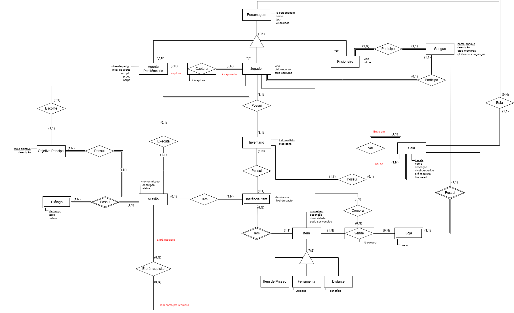

## Introdução 

O Diagrama Entidade-Relacionamento (DER) é uma representação gráfica composta por diversos elementos que visam ilustrar os principais componentes do modelo Entidade-Relacionamento. Estes componentes incluem entidades, atributos, chaves primárias, relacionamentos e restrições estruturais, entre outros.

Este diagrama oferece uma visão lógica do banco de dados, proporcionando uma compreensão abrangente da estrutura dos dados dentro de um sistema. Ele ajuda a visualizar como as entidades estão relacionadas umas com as outras e como os dados estão organizados, oferecendo assim um conceito mais amplo sobre a estruturação dos dados em um sistema.

## Metodologia 

Para criar o Diagrama de Entidade-Relacionamento (DER), utilizamos o Lucidchart e o Miro, que são plataformas online de diagramação que oferece uma variedade de ferramentas e recursos para criar e visualizar diagramas de forma colaborativa e intuitiva.

Uma vantagem significativa dessas plataformas foi a capacidade de colaborar em tempo real com outros membros da equipe. Isso nos permitiu trabalhar juntos na criação e revisão do diagrama, facilitando a comunicação e garantindo a precisão do resultado final.

## Diagrama Entidade-Relacionamento

Caso não seja possível visualizar o Diagrama Entidade relacionamento pela imagem, tente pelo iframe do draw.io logo abaixo:

<iframe frameborder="0" style="width:100%;height:1105px;" src="https://viewer.diagrams.net/?tags=%7B%7D&lightbox=1&highlight=0000ff&edit=_blank&layers=1&nav=1&title=DER_Prision_Break.drawio&dark=auto#Uhttps%3A%2F%2Fdrive.google.com%2Fuc%3Fid%3D1wi6IxcUiXtU1OVYFu6NfL4SPxfWGVimA%26export%3Ddownload"></iframe>

## 📑 Histórico de Versões

| **Versão**   |   **Data**   | **Descrição** | **Autor** |
|--------|---------|-----------|--------|
|`1.0`| 21/04/2025 | Criação da página Diagrama Entidade-Relacionamento| [Mayara Alves](https://github.com/Mayara-tech)| 