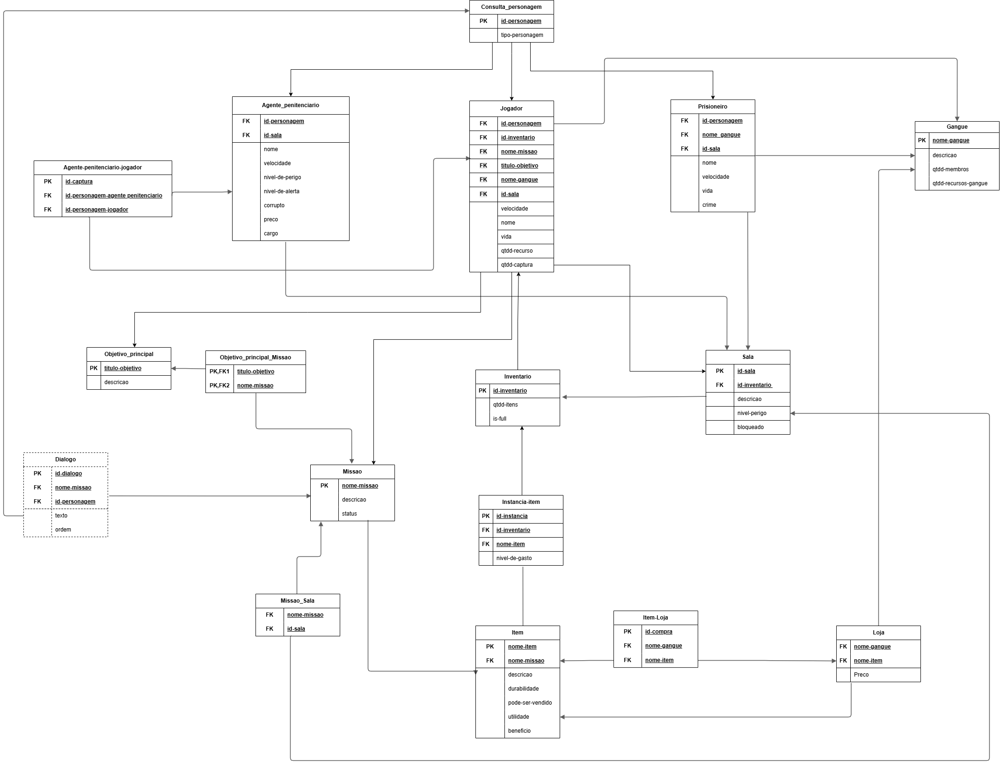

## Introdução

O Modelo Relacional (MREL) é uma ferramenta essencial na modelagem de dados, fornecendo uma representação lógica detalhada das entidades e seus relacionamentos no contexto do banco de dados. Ao contrário de artefatos específicos de um sistema de gerenciamento de banco de dados (SGBD), o MREL é independente de plataformas, oferecendo uma visão abstrata e organizada da estrutura de dados. 

Ele descreve como as entidades estão interligadas e como os dados são organizados, permitindo uma compreensão profunda da arquitetura do banco de dados e facilitando o processo de implementação e manutenção do sistema.

## Metodologia 

A metodologia utilizada para construção do modelo relacional iniciou-se com o mapeamento das entidades e seus atributos a partir do Modelo Entidade-Relacionamento (MER) previamente elaborado. Em seguida, foram identificadas as chaves primárias de cada entidade e estabelecidos os relacionamentos entre elas, garantindo a integridade referencial dos dados.

Posteriormente, o modelo foi submetido à normalização para eliminar redundâncias e garantir a consistência das informações. Por fim, o modelo foi representado em um diagrama relacional, demonstrando de forma clara e organizada as tabelas, chaves primárias e chaves estrangeiras que compõem a estrutura do banco de dados.

## Modelo Relacional

{:  display: block; margin: 0 auto;" }

Caso não seja possível visualizar o Diagrama Entidade relacionamento pela imagem, tente pelo iframe do draw.io logo abaixo:

<iframe frameborder="0" style="width:100%;height:1637px;" src="https://viewer.diagrams.net/?tags=%7B%7D&lightbox=1&highlight=000000&layers=1&nav=1&title=DER_Prision_Break.drawio&page-id=yQuUzBaqXDNsPbDaUIF-&dark=auto#Uhttps%3A%2F%2Fdrive.google.com%2Fuc%3Fid%3D1wi6IxcUiXtU1OVYFu6NfL4SPxfWGVimA%26export%3Ddownload"></iframe>

## 📑 Histórico de Versões

| **Versão**   |   **Data**   | **Descrição** | **Autor** |
|--------|---------|-----------|--------|
|`1.0`| 21/04/2025 | Criação da página do modelo relacional| [Mayara Alves](https://github.com/Mayara-tech)| 
|`2.0`| 01/05/2025 | Criação do modelo relacional| [Ana Carolina](https://github.com/anawcarol) e [Renann Gomes](https://github.com/renannOgomes)|
|`2.1`| 02/05/2025 | Ajuste do modelo relacional| [Ana Carolina](https://github.com/anawcarol) e [Renann Gomes](https://github.com/renannOgomes)|
|`3.0`| 13/06/2025 | Altera imagem do Modelo Relacional e adiciona embed | [Maria Alice](https://github.com/Maliz30)| 
