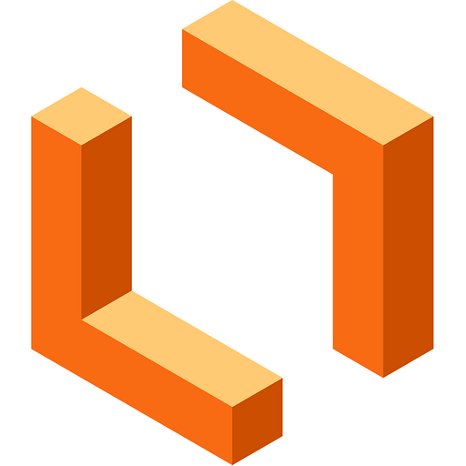

# Ferramentas

## Introdução

 &emsp;&emsp; A escolha das ferramentas adequadas é essencial para o sucesso de projetos. Elas são vitais para aprimorar a eficiência e facilitar a comunicação e colaboração entre os membros da equipe. Este documento destaca o conjunto de ferramentas selecionadas para apoiar e otimizar nosso projeto, com base na experiência que adquirimos ao longo do projeto. 

A **Tabela 1** detalha as ferramentas que utilizamos durante todo o projeto:

## Ferramentas 

<strong> Tabela 1 - Ferramentas Utilizadas </strong>

| Ferramenta | Nome | Finalidade |
| :------------: | :------: | ------------ |
| | GitHub | Serve para controle de versão e colaboração em projetos, com rastreamento de alterações e revisão de código, facilitando a colaboração organizada. |
|  | WhatsApp | Plataforma de mensagens para comunicação rápida e direta entre membros da equipe. |
|  | Discord | Plataforma de reunião rápida para comunicação direta entre membros da equipe. |
| | Google Meet | Plataforma para realização das reuniões do projeto gravadas. |
| | Lucidchart | Plataforma para criação dos diagramas de entidade-relacionamento |
| | Miro | Plataforma para criação dos diagramas de entidade-relacionamento |
| | PostgreSQL | Sistema de gerenciamento de banco de dados relacional de código aberto |
| | VSCode | editor de código-fonte desenvolvido pela Microsoft |

  

## Bibliografia
>GITHUB. Disponível em: [GitHub](https://github.com). Acesso em: 14 de abril de 2025. 
>WHATSAPP. Disponível em: [Whatsapp](https://web.whatsapp.com/) Acesso em: 14 de abril de 2025. 
>GOOGLE MEET. Disponível em: [Google Meet](https://meet.google.com/).Acesso em: 14 de abril de 2025  
>LUCIDCHART. Disponível em: [Lucidchart](https://www.lucidchart.com/).Acesso em: 14 de abril de 2025. 
>MIRO. Disponível em: [Miro](https://miro.com/app/).Acesso em: 14 de abril de 2025. 
>DISCORD. Disponível em: [Discord](https://discord.com/).Acesso em: 14 de abril de 2025. 
>POSTGRESQL. Disponível em: [PostgreSQL](https://www.postgresql.org/).Acesso em: 14 de abril de 2025. 
>VSCODE. Disponível em: [VSCode](https://code.visualstudio.com/).Acesso em: 14 de abril de 2025. 

## 📑 Histórico de Versões

| Versão  |    Data    |       Descrição       |Autor(es)                |
| :-----: | :--------: | :-------------------------:|:----------------------------------: | 
|`1.0` | 14/04/2025 | Criação da página de ferramentas.    | [Mayara Alves](https://github.com/Mayara-tech)|